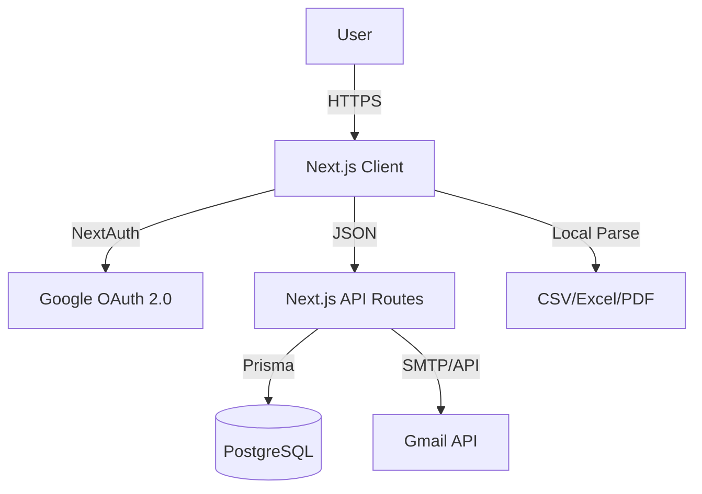

# 📂 Project Specification: Outrexo
**Version:** 1.0.0
**Status:** In Development
**Design Reference:** Vortasky AI (Dribbble)
**Tech Stack:** Next.js 16, TypeScript, Tailwind CSS, Prisma, NextAuth.js

---

## 1. Executive Summary
**Outrexo** is a secure, serverless email automation platform designed to streamline HR outreach. It enables users to send personalized, bulk emails using their own Gmail credentials via OAuth 2.0. The system emphasizes security (zero password storage), ease of use (universal file parsing), and a high-fidelity "Dark SaaS" aesthetic.

---

## 2. System Architecture

The application follows a **Serverless Monolith** architecture hosted on Next.js.

### High-Level Data Flow
1.  **Client (Browser):** Handles file parsing (CSV/XLSX), state management, and UI rendering.
2.  **Next.js API Routes (Edge/Serverless):** Acts as the backend controller for authentication and email dispatching.
3.  **Database (PostgreSQL):** Stores user profiles, campaign history, and saved templates.
4.  **Google APIs:** External service for authentication (OAuth) and email delivery (Gmail API).

### Diagram (Mermaid)


## 3. Tech Stack Specification

| Component | Technology | Reasoning |
| :--- | :--- | :--- |
| **Framework** | Next.js 16 (App Router) | Server Components for performance; unified backend. |
| **Language** | TypeScript | Type safety for complex HR data objects. |
| **Styling** | Tailwind CSS | Rapid, utility-first styling for the "Vortasky" dark theme. |
| **Animations** | Framer Motion | Essential for the smooth, futuristic UI interactions. |
| **Auth** | NextAuth.js (v5) | Native Google OAuth integration; secure session handling. |
| **Database** | PostgreSQL + Prisma ORM | Relational data integrity for users and logs. |
| **Email** | googleapis (Gmail) | Official Google library for secure sending. |
| **State** | Zustand | Lightweight global state for the "Campaign Queue". |
| **Parsing** | papaparse, xlsx | Robust client-side file handling. |

## 4. Database Schema (Prisma)

Current `schema.prisma` file:

```prisma
model User {
  id            String     @id @default(cuid())
  name          String?
  email         String     @unique
  image         String?
  emailVerified DateTime?
  password      String?
  
  // SMTP Configuration
  smtpHost      String?
  smtpPort      Int?
  smtpUser      String?
  smtpSecure    Boolean?   @default(true)
  smtpPassword  String?    // Encrypted
  smtpIV        String?    // Initialization Vector for encryption

  accounts      Account[]
  campaigns     Campaign[]
  templates     Template[]
  sessions      Session[]
}

model Account {
  id                String  @id @default(cuid())
  userId            String
  type              String
  provider          String
  providerAccountId String
  refresh_token     String? @db.Text
  access_token      String? @db.Text
  expires_at        Int?
  token_type        String?
  scope             String?
  id_token          String? @db.Text
  session_state     String?

  user User @relation(fields: [userId], references: [id], onDelete: Cascade)

  @@unique([provider, providerAccountId])
}

model Session {
  id           String   @id @default(cuid())
  sessionToken String   @unique
  userId       String
  expires      DateTime
  user         User     @relation(fields: [userId], references: [id], onDelete: Cascade)
}

model VerificationToken {
  identifier String
  token      String   @unique
  expires    DateTime

  @@unique([identifier, token])
}

model Template {
  id        String   @id @default(cuid())
  userId    String
  name      String // e.g. "Software Engineer Pitch"
  subject   String
  body      String // HTML content with {{variables}}
  createdAt DateTime @default(now())
  updatedAt DateTime @updatedAt

  user User @relation(fields: [userId], references: [id], onDelete: Cascade)
}

model Campaign {
  id        String   @id @default(cuid())
  userId    String
  name      String
  status    String // "DRAFT", "COMPLETED", "IN_PROGRESS"
  sentCount Int      @default(0)
  failCount Int      @default(0)
  createdAt DateTime @default(now())

  logs EmailLog[]
  user User       @relation(fields: [userId], references: [id], onDelete: Cascade)
}

model EmailLog {
  id         String   @id @default(cuid())
  campaignId String
  recipient  String
  status     String // "SENT", "BOUNCED", "FAILED"
  error      String?
  sentAt     DateTime @default(now())

  campaign Campaign @relation(fields: [campaignId], references: [id], onDelete: Cascade)
}
```

## 5. API Endpoints Specification

### A. Authentication
- **Route:** `/api/auth/[...nextauth]`
- **Method:** GET, POST
- **Purpose:** Handles login, logout, and token rotation.

### B. Send Email (Single)
- **Route:** `/api/email/send`
- **Method:** POST
- **Middleware:** Protected (Requires active Session)
- **Payload:**
```json
{
  "to": "hr@company.com",
  "subject": "Application for Dev Role",
  "htmlBody": "<p>Hello {{Name}}...</p>",
  "campaignId": "cmp_123"
}
```
- **Response:** 200 OK (Message ID) or 429 Too Many Requests (Rate Limit).

### C. Templates
- **Route:** `/api/templates`
- **Method:** GET (List all), POST (Create new)
- **Method:** PUT (Update), DELETE (Remove)

## 6. Functional Requirements Breakdown

### 6.1 Authentication & Security
- **Requirement:** Users must log in via Google.
- **Scope:** The app must request `https://www.googleapis.com/auth/gmail.send`.
- **Token Management:** If an `access_token` expires (usually after 1 hour), the system must use the `refresh_token` stored in the Account table to silently fetch a new one without logging the user out.

### 6.2 File Parsing Engine (Client-Side)
- **Drag & Drop:** Implement a dropzone using `react-dropzone`.
- **Mapping Logic:**
  - System scans header row.
  - Fuzzy match headers: `["Email", "e-mail", "mail"]` -> `email`.
  - Fuzzy match headers: `["Name", "Full Name", "Candidate"]` -> `name`.
- **Preview:** Display the first 5 rows in a table before import confirmation.

### 6.3 Dynamic Template Engine
- **Rich Text:** Use a lightweight WYSIWYG editor (e.g., TipTap or Quill).
- **Variable Injection:**
  - User types `{{` -> Trigger a dropdown of available columns (Name, Company, etc.).
  - On send, regex replaces `{{Key}}` with data. If data is missing, replace with generic fallback (e.g., "Hiring Manager").

### 6.4 The Queue System (Frontend)
- **Logic:** Since this is a browser-driven mass sender, we cannot loop 100 emails instantly or Google will block the account.
- **Implementation:**
  - Use an async queue with a concurrency of 1.
  - Add a random delay: `await delay(Math.random() * 2000 + 1000)`.
  - Update a progress bar state: `(sent / total) * 100`.

## 7. UI/UX Design Specifications
- **Theme:** "Vortasky Dark"
- **Font:** Inter (variable)
- **Core Components**
  - **Sidebar:** Glassmorphism effect (`backdrop-blur-xl`). Collapsible state. Links: Dashboard, Campaigns, Templates, Settings.
  - **Dashboard:**
    - **Hero Card:** "Welcome back, [User]". Gradient text.
    - **Stats Grid:** 3 Cards (Emails Sent, Templates Created, Success Rate).
    - **Recent Activity:** Table with status badges (Green "Sent", Red "Failed").
  - **Campaign Builder (Wizard Step):**
    - Step 1: Upload Data.
    - Step 2: Select/Edit Template.
    - Step 3: Preview & Test.
    - Step 4: Launch.

## 8. Development Roadmap
- **Phase 1: Skeleton & Auth**
  - Setup Next.js + Tailwind.
  - Implement NextAuth with Google Provider.
  - Create Prisma schema and migrate DB.
- **Phase 2: Core Logic**
  - Build File Upload & Parsing (Client-side).
  - Create `/api/email/send` endpoint.
  - Connect Gmail API.
- **Phase 3: UI Polish**
  - Apply "Vortasky" dark theme.
  - Add Framer Motion animations.
  - Build the Dashboard charts.
- **Phase 4: Optimization**
  - Implement rate limiting / queue delays.
  - Error handling for bounced emails.
